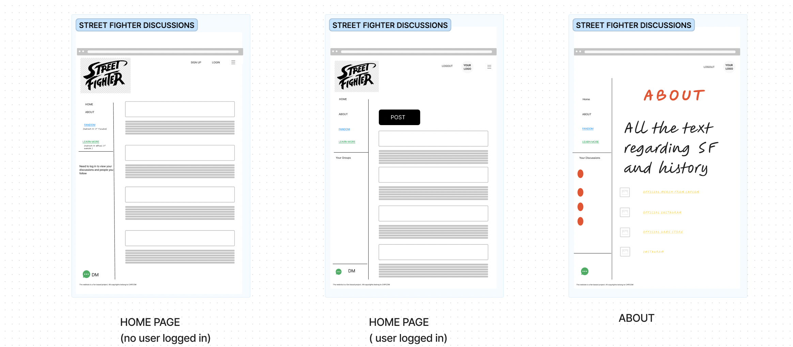
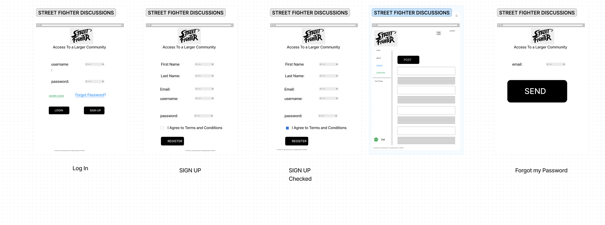
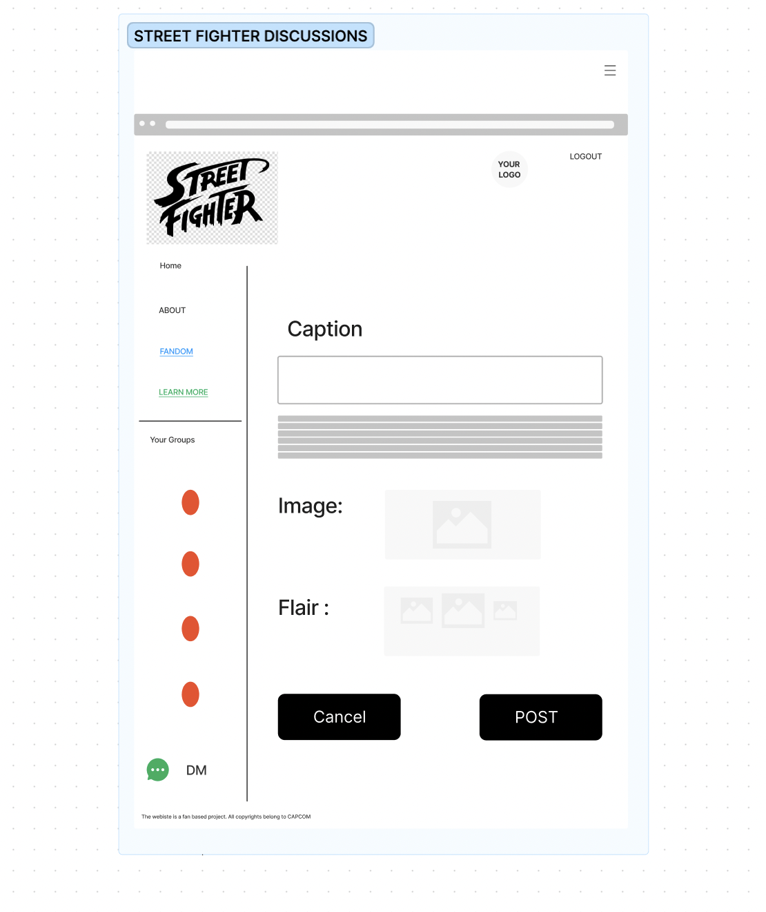
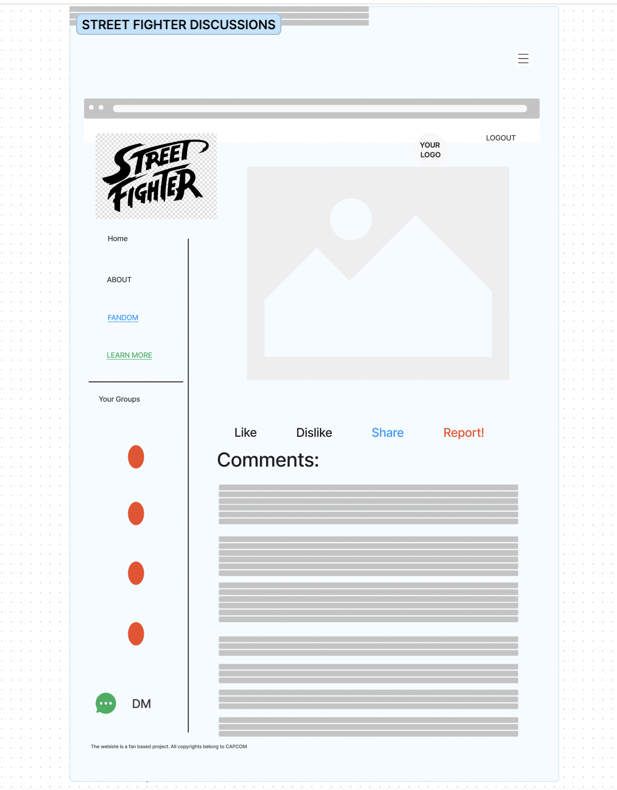
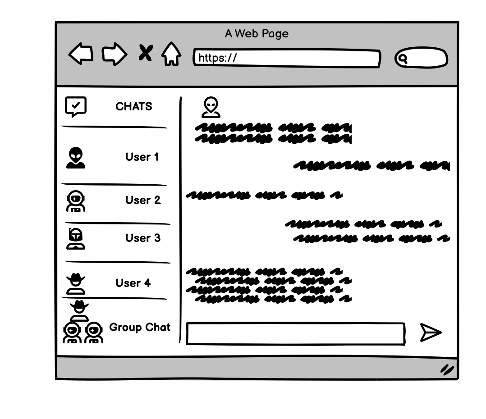
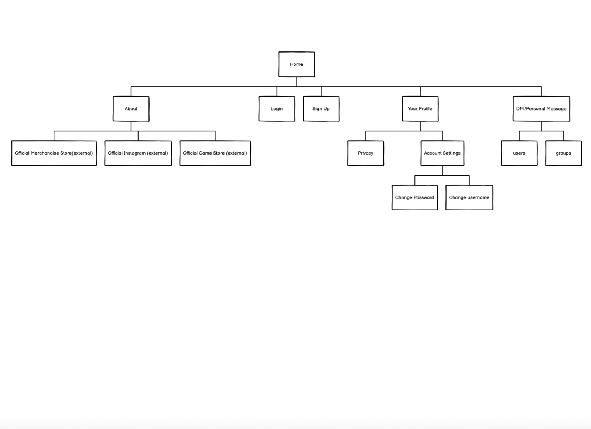
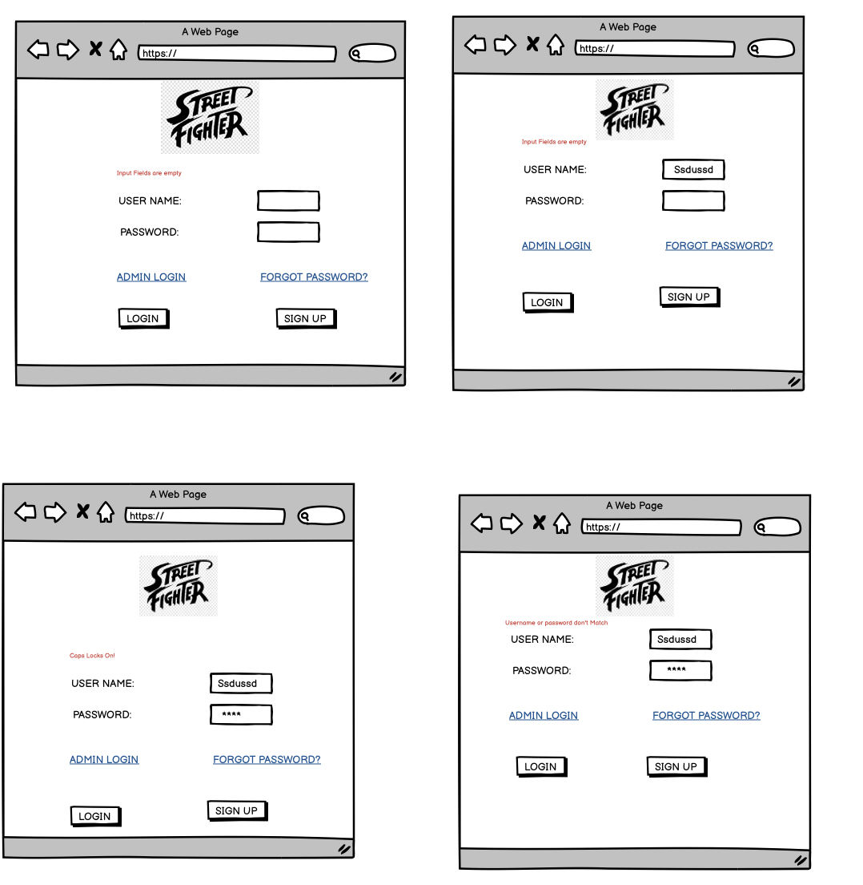

# Milestone 2

## Layout

## Site Map

The following shows how the website is mapped and how each page is linked with the other :

## Logic Process

The user when first enters the site can see the default home page with various reccomended and top posts. User can then either log in if already has an account or sign up.

If he chooses to sign in, is redirected to the page with log in form, and enter his details . If entered correctly, the usser is logged in and redirected back to home page with updated UI. If user forgets his pass word, he can click "Forgot Password" to send a verification code to his email (for simplicity of the project, we assume email has already been sent and the user just enters a new password.)

If the user selects sign up , it redirects them to a form where they can fill their username, password, first and last name, and email to register an account. The user is then redirected to the updated home page

The update home page now lets users to upload a post in the forum. It also allows user to join new forum discussions as well as comment on posts, as well as the feazture of liking, dislikng, and sharing the post. The user can even report the post if it goes against the guidlines of the site.

The user clicks on the ABOUT page and which shows the purpose of site and a small description about the game franchise as well. It also links externally to the official merchandise store, official social media links, store where users can purchase the game, and other external links.

The user can also able to message other users personally and also form groups in those

## Design :

The website is to have a simplistic design with first time users easily able to navigate the website and able to learn as soon as they test out the features.

## Client Side Validation

The following image shows the various process of the validation of the website

